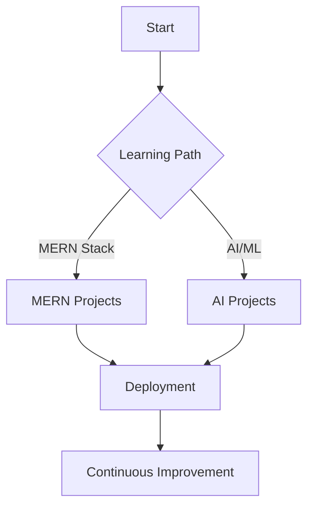

<div align="center">

# 🚀 Hiba Shahid
### MERN Stack Developer & AI Enthusiast


<p align="center">
  
  
</p>

---

### 🌟 About Me

```javascript
const hiba = {
    name: "Hiba Shahid",
    role: "Full Stack Developer & AI Student",
    location: "🌍 Earth",
    currentFocus: ["MERN Stack", "Artificial Intelligence", "Machine Learning"],
    funFact: "I debug with console.log and I'm not ashamed! 😄",
    motto: "Code, Learn, Innovate, Repeat 🔄"
};

console.log("Welcome to my digital universe! 🌌");
```

---

## 🛠️ Tech Arsenal

### ✨ Frontend Magic
- React.js, Redux, HTML5, CSS3, JavaScript

### 🔮 Backend Sorcery
- Node.js, Express.js, MongoDB

### 🤖 AI & ML Universe
- Python, Scikit-learn, TensorFlow

### 🔧 Tools & Platforms
- Git & GitHub, VS Code, Docker

---

## 📊 GitHub Analytics

<div align="center">
  
  
</div>

<div align="center">
  
</div>
<div align="center">
  
</div>

---

## 🎯 Current Learning Journey



---

## 🏆 Achievements & Milestones

| 🏅 Milestone          | 📅 Status      | 🌟 Description                           |
|----------------------|---------------|------------------------------------------|
| 🥇 First MERN App    | ✅ Completed   | Built my first full-stack application    |
| 🤖 AI Model Deployment | 🔄 In Progress | Deploying ML models to production        |
| 📱 Mobile App        | 🗂️ Planned     | React Native mobile application          |
| 🎓 AI Certification  | 🔄 In Progress | Advanced AI/ML certification             |

---

## 🌈 Fun Zone

### 🎵 Coding Playlist
*Currently vibing to:* **Lo-fi Hip Hop Radio** 🎧

### ☕ Coffee Counter
☕☕☕☕☕☕☕☕☕☕ (10 cups today... and counting!)

### 🎮 When I'm Not Coding
- 🎯 Learning new AI algorithms
- 📚 Reading tech blogs
- 🎮 Gaming (strategy games are my favorite!)
- 🌱 Contributing to open source

---

## 📈 Skill Progress Bars

**JavaScript** 🟦🟦🟦🟦🟦🟦🟦🟦⬜⬜ 80%  
**React.js** 🟦🟦🟦🟦🟦🟦🟦🟦⬜⬜ 85%  
**Node.js** 🟦🟦🟦🟦🟦🟦🟦⬜⬜⬜ 75%  
**MongoDB** 🟦🟦🟦🟦🟦🟦🟦⬜⬜⬜ 70%  
**Python** 🟦🟦🟦🟦🟦🟦🟦🟦⬜⬜ 80%  
**Machine Learning** 🟦🟦🟦🟦🟦🟦⬜⬜⬜⬜ 65%  
**AI/Deep Learning** 🟦🟦🟦🟦🟦⬜⬜⬜⬜⬜ 55%  

---

## 🤝 Let's Connect & Collaborate!

### 💬 "Great minds discuss ideas, average minds discuss events, small minds discuss people." - Eleanor Roosevelt

<p align="center">
  <a href="mailto:hibe.shahid@example.com">
    
  </a>
  <a href="https://linkedin.com/in/hibeshahid">
    
  </a>
  <a href="https://twitter.com/hibeshahid">
    
  </a>
  <a href="https://hibeshahid.dev">
    
  </a>
</p>

### 🎯 Open for:
- 💼 **Freelance Projects**
- 🤝 **Collaboration Opportunities**
- 🎓 **Mentorship** (both giving and receiving)
- 💡 **Innovative Ideas Discussion**

---

## 🎨 Featured Projects

### 🌟 Project Showcase

<table>
  <tr>
    <td align="center">
      <h3>🛒 E-Commerce Platform</h3>
      <p><strong>MERN Stack</strong></p>
      <p>Full-featured online store with payment integration</p>
      <a href="#"></a>
    </td>
    <td align="center">
      <h3>🤖 AI Chatbot</h3>
      <p><strong>Python + NLP</strong></p>
      <p>Intelligent conversational AI with sentiment analysis</p>
      <a href="#"></a>
    </td>
  </tr>
  <tr>
    <td align="center">
      <h3>📊 Data Visualization</h3>
      <p><strong>React + D3.js</strong></p>
      <p>Interactive dashboard for data analytics</p>
      <a href="#"></a>
    </td>
    <td align="center">
      <h3>🎵 Music Recommendation</h3>
      <p><strong>ML + Python</strong></p>
      <p>AI-powered music suggestion system</p>
      <a href="#"></a>
    </td>
  </tr>
</table>

---

## 🎭 Random Developer Humor

### 😄 Daily Dose of Code Humor

> **Why do programmers prefer dark mode?**
>
> Because light attracts bugs! 🐛💡

---

### 🎯 My Debugging Process:
1. 🤔 "This should work..."
2. 😕 "Why doesn't this work?"
3. 😤 "This code is stupid!"
4. 😅 "Oh wait, I'm stupid..."
5. 🎉 "It works!"

---

## 🌟 Support My Journey

<div align="center">
If you find my work helpful or inspiring, consider:

⭐ **Starring my repositories**  
🍴 **Forking interesting projects**  
🐛 **Reporting bugs or suggesting features**  
☕ **Buying me a coffee** (virtual hugs work too!)

 <em><b>I love connecting with different people</b> so if you want to say <b>hi, I'll be happy to meet you!</b></em>
</div>

---


---

<div align="center">
### 🚀 "Code is like humor. When you have to explain it, it's bad." - Cory House

**Made with ❤️ by Hiba Shahid**

*Last updated: May 30, 2025*
</div>
